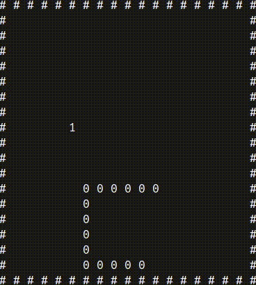

# Assembly Snake




---

Just the classic game Snake for the terminal, that I made in assembly while exercising for the Logical Circuits exam and for fun.  
It was made for DOS, but I wanted to run it on a linux terminal to make it more accessible, and so I converted it by changing the interrupts of DOS with linux's syscalls and libc and ncurses functions.

To build the image use this command when you are in the directory where the Dockerfile is located:<br>
```bash
docker build -t assembly-snake .
```

To run the image as a container use the following command (make sure your terminal window is large enough):<br>
```bash
docker run -it --rm assembly-snake
```


---

## To do

- Add the possibility to choose the map dimension.
- Improve the fruit position decision when there is a collision with the snake's body: as of right now, if the random position caused a collision, we look iteratively all the map for a free spot (a spot without the snake body). As a result, it's common to have the fruit in the first cell (top-left corner)  when the snake occupies most of the map, because there is a high chance to hit the body.  
We might do something different like searching a new spot around the cell that hitted the body, instead of following always the same order.